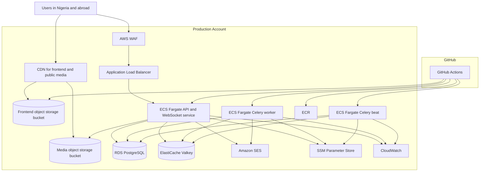

# Corpershub Cloud Deployment Architecture Recommendation

Reviewed on: 2026-03-23

## Executive Recommendation

Use AWS as the primary cloud platform, with separate `development` and `production` workload accounts under AWS Organizations, and place both live workloads in `eu-west-1` (Ireland).

Recommended target stack:

- Frontend: static export to object storage plus CDN
- Backend API and WebSockets: Amazon ECS on AWS Fargate (ARM/Graviton)
- Database: Amazon RDS for PostgreSQL
- Cache, broker, Channels layer: Amazon ElastiCache for Valkey
- File storage: Amazon S3 or another S3-compatible object store
- Email: Amazon SES
- Edge security: AWS WAF on the public backend entry point
- DNS/TLS: Route 53 plus ACM
- Secrets and config: AWS Systems Manager Parameter Store (`SecureString`)
- Logs and alarms: Amazon CloudWatch
- CI/CD: GitHub Actions with OIDC into AWS

This is the best balance of cost, operational simplicity, security, and growth headroom for the current codebase.

## Why This Fits The Codebase

The repository is already structured around a split web/API deployment:

- `apps/web/` is a Next.js application.
- `apps/api/` is a Django ASGI application with REST, Channels, Celery, PostgreSQL, Redis, and S3-compatible storage.
- `infra/docker-compose.yml` already models the runtime split into `backend`, `celery-worker`, `celery-beat`, `postgres`, `redis`, and `minio`.

The live platform must support all of the following:

- HTTP API traffic
- WebSocket traffic for chat
- Background jobs and scheduled jobs
- PostgreSQL
- Redis-compatible broker/cache
- Object storage for uploads
- Transactional email for OTP and password reset
- Public webhook endpoints for payment gateways

## Region Recommendation

Recommended AWS region: `eu-west-1` (Ireland)

Why:

- It has broader managed-service coverage than most lower-cost alternatives.
- It is materially cheaper than `af-south-1` for the services this app needs.
- For a Nigeria-heavy audience, the Europe region is usually the strongest cost/latency compromise once CDN caching is added in front of static assets.

This is an inference, not a direct AWS latency publication. Before final cutover, run synthetic latency checks from Lagos and Abuja against `eu-west-1` and `eu-central-1` and keep the lower-latency result if the difference is meaningful.

## Account And Domain Model

Recommended account structure:

- AWS Organizations management account for billing, guardrails, and consolidated logging
- `Corpershub-dev` workload account
- `Corpershub-prod` workload account

This keeps the two requested workload environments cleanly separated while still using AWS best practice for centralized billing and policy control.

Recommended domain layout:

- Root domain: `Corpershub.com`
- Development subdomain: `dev.Corpershub.com`
- Backend API host: `api.Corpershub.com`
- Development API host: `api.dev.Corpershub.com`

Recommended DNS model:

- Keep the parent public hosted zone for `Corpershub.com` in the production/shared DNS boundary.
- Delegate `dev.Corpershub.com` to a hosted zone in the development account.

## Recommended Runtime Architecture

## Environment Topology

### Development / Sandbox

Goal: low cost, close enough to production to validate releases

- Same logical architecture as production
- Smaller Fargate task sizes
- Single-AZ RDS
- Single-node Valkey
- Auto-scheduled start/stop outside working hours
- Lower CloudWatch retention
- No need for paid WAF rules unless exposed to wider external testing

### Production / Live

Goal: secure public service that can grow from about 10,000 to about 200,000 users

- Multi-service ECS deployment
- Separate API/WebSocket service, worker service, and beat service
- PostgreSQL on RDS
- Valkey on ElastiCache
- Public static assets on object storage and CDN
- WAF in front of the backend entry point
- Separate secrets, logs, and alarms

## Networking Recommendation

Recommended VPC layout per workload account:

- 1 VPC
- 2 availability zones
- Public subnets for ALB and ECS tasks
- Private subnets for RDS and ElastiCache

Why public ECS tasks instead of private ECS plus NAT in v1:

- NAT gateways add meaningful monthly cost.
- The app still needs outbound internet access for payment gateways and email-related integrations.
- ECS tasks can remain secure with public IPs if inbound security groups only allow traffic from the ALB security group and no direct internet ingress is permitted.

If later compliance requirements demand stricter egress control, move ECS tasks into private subnets and introduce NAT or egress proxies.

## Compute Recommendation

Run the Django backend as three separate ECS services:

- API/WebSocket service
- Celery worker service
- Celery beat service

Why:

- The codebase already separates these processes in `infra/docker-compose.yml`.
- WebSocket traffic has different scaling behavior from background jobs.
- Beat should not be tied to worker restarts.

Use ARM64 images on Fargate where possible:

- The codebase is Python and Node only, which is ARM-friendly.
- Current AWS Fargate ARM pricing is lower than x86.

## Data Layer Recommendation

### PostgreSQL

Use Amazon RDS for PostgreSQL.

Launch baseline:

- `db.t4g.medium`, Single-AZ, 100 GB gp3

Growth baseline:

- `db.t4g.large`, Single-AZ, 300 GB gp3

Why not self-managed Postgres on EC2:

- Higher operational risk
- Harder backups and failover
- More patching burden

### Redis-Compatible Layer

Use Amazon ElastiCache for Valkey instead of Redis OSS.

Why:

- Lower cost than equivalent Redis OSS nodes
- Redis protocol compatible for Django cache, Channels, and Celery
- No application rewrite required

Launch baseline:

- `cache.t4g.small`, single node

Growth baseline:

- `cache.t4g.medium`, primary plus replica

## Storage Recommendation

Use two object storage buckets:

- `frontend-static` for the exported frontend
- `public-media` for uploaded files and public marketing images

Why two buckets:

- Cleaner lifecycle policies
- Easier permissions
- Easier cache-control separation

Recommended defaults:

- Server-side encryption enabled
- Versioning enabled on media
- Lifecycle rules for stale artifacts
- CDN in front of both buckets

## Frontend Static Hosting Readiness

The current frontend is close to object-storage hosting, but it is not fully ready for pure S3-style hosting as-is.

### What already helps

- Authentication state lives in browser `localStorage`, not in server-side sessions.
- Most application data is fetched client-side from the backend API.
- WebSocket URLs are already configured through environment variables.

### What currently blocks a pure object-storage deployment

- `apps/web/src/app/api/home-backgrounds/[name]/route.ts` uses a Next.js Node runtime route.
- `apps/web/src/app/company/students/[id]/page.tsx` depends on runtime route params.
- `apps/web/src/app/student/companies/[id]/page.tsx` depends on runtime route params.
- `apps/web/src/app/company/chat/[id]/page.tsx` depends on runtime route params.
- `apps/web/src/app/student/chat/[id]/page.tsx` depends on runtime route params.

### Recommendation

Before the final frontend cutover to object storage:

1. Move homepage background images to direct bucket/CDN URLs instead of the Next.js proxy route.
2. Convert dynamic detail/chat pages into static-compatible client routes.

The refactor is feasible and relatively contained because the app is already mostly client-rendered.

## Security Requirements

### Mandatory before production

- Set `DJANGO_SETTINGS_MODULE=config.settings.production` for all backend tasks.
- Override permissive defaults from `apps/api/config/settings/base.py`.
- Set `CORS_ALLOW_ALL_ORIGINS=False`.
- Set explicit `CORS_ALLOWED_ORIGINS`.
- Set explicit `DJANGO_ALLOWED_HOSTS`.
- Replace all default or example secrets.
- Move email credentials, payment keys, JWT settings, and encryption keys into Systems Manager Parameter Store using `SecureString` values.
- Force `https://` and `wss://` public endpoints only.
- Put WAF in front of the public backend entry point.
- Restrict RDS and ElastiCache to private subnets and security-group-only access.

### Codebase-specific observations

- `apps/api/config/asgi.py` defaults to `config.settings.local` if the environment variable is missing, so production tasks must set the production settings module explicitly.
- `apps/api/config/settings/base.py` contains permissive development defaults such as wildcard hosts and allow-all CORS, which are fine locally but not acceptable in production.
- `apps/api/.env.example` contains demo/test placeholders and should never be promoted into production secrets.

## Email Recommendation

Use Amazon SES, not Gmail SMTP, for live OTP and reset emails.

Why:

- Better deliverability
- Cleaner domain verification
- Better rate limits
- Easier operational visibility

## CI/CD Recommendation

Keep GitHub Actions as the CI/CD control plane.

Recommended deployment flow:

1. Pull request runs existing tests and build checks.
2. Merge to `main` deploys automatically to development.
3. Production deploy requires manual approval.
4. Backend images are built and pushed to ECR.
5. Database migrations run as a one-off ECS task before service rollout.
6. Frontend build publishes static assets to object storage and invalidates CDN cache.

Use GitHub OIDC to assume AWS roles. Do not store long-lived AWS access keys in GitHub secrets.

## Scaling Path

### Launch phase: about 10,000 users

- 2 API tasks
- 1 worker task
- 1 beat task
- Single-AZ RDS
- Single-node Valkey
- CDN for frontend/media

### Growth phase: about 200,000 users

- API autoscaling to 4 to 8 tasks
- Worker autoscaling to 2 to 4 tasks
- Larger Single-AZ database instance
- Primary plus replica Valkey
- Stronger alarms, backup retention, and canary checks

The current app shape suggests the first scaling pressure will likely be:

1. database connections and query tuning
2. Redis memory and connection count
3. CDN egress for frontend and public media

## Backups, Recovery, And Operations

Recommended defaults:

- RDS automated backups with point-in-time recovery
- 7 days retention in dev, 30 days in prod
- ElastiCache snapshots
- Object storage versioning on media bucket
- Daily health checks and alarms for API, DB, Redis, queue failures, and high 5xx rate
- Access logging for ALB and CDN

## Lower-Cost Alternative Worth Considering

Because the backend already supports S3-compatible storage through `AWS_S3_ENDPOINT_URL`, there is a credible lower-cost alternative for frontend and public media storage:

- Keep compute, database, Redis, secrets, and email on AWS
- Use Cloudflare R2 for static frontend and public media

Why this is attractive:

- No egress fees for public asset delivery
- S3-compatible API
- Usually much lower cost than S3 plus CDN for a read-heavy product

I would still keep the primary recommendation AWS-first for the backend and data plane, but R2 is the cleanest cost optimization if frontend/media bandwidth grows quickly.

## What I Would Not Recommend

- A single VM running Docker Compose in production
- Kubernetes as the first production platform
- Self-managed PostgreSQL or Redis on EC2

These options either increase operational risk too early or create unnecessary platform overhead for the current stage.

## Recommended Next Steps

1. Decide whether to stay AWS-only for storage/CDN or use the lower-cost S3-compatible storage alternative for frontend and media.
2. Make the small frontend static-hosting refactor.
3. Add AWS IaC for the two workload accounts, networking, ECS, RDS, ElastiCache, buckets, WAF, and CI/CD roles.
4. Replace development SMTP assumptions with SES.
5. Run pre-production latency tests from Nigeria against the chosen public endpoints before DNS cutover.
